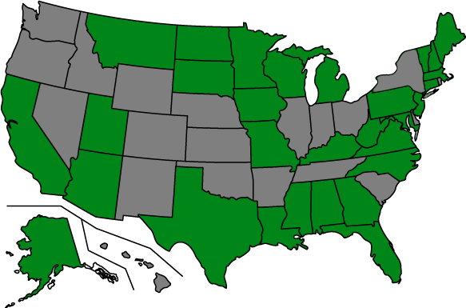

.. Fifty State Project documentation master file, created by
   sphinx-quickstart on Thu Oct 29 19:14:07 2009.
   You can adapt this file completely to your liking, but it should at least
   contain the root `toctree` directive.

The Fifty State Project
=======================

The Fifty State Project collects and makes available data about state legislative activities, including bill summaries, votes, sponsorships and state legislator information. This data is gathered directly from the states and made available in a common format for interested developers, through
a :doc:`RESTful API <api>` and through upcoming data dumps. To make working with the API easier, a :doc:`Python client library <client>` is available.

Because most states do not make their legislative data publicly available in structured formats, we need
to write scrapers to parse information from their publicly-facing websites. This is a large task and one we can always use help on. The below map gives a rough idea of our current status: green states have data available (or will very shortly), while we are still looking for :doc:`help <contributing>` filling in grey states.

Links
-----

.. toctree::
   :maxdepth: 1
   
   api
   python-fiftystates: Python API client <client>
   Code on GitHub <http://github.com/sunlightlabs/fiftystates>
   Contributing Scrapers <contributing>
   Google Group <http://groups.google.com/group/fifty-state-project>
   Sunlight Labs <http://sunlightlabs.com/>
   Help us digitize roll call votes in Kentucky <http://transparencycorps.org/campaigns/11>